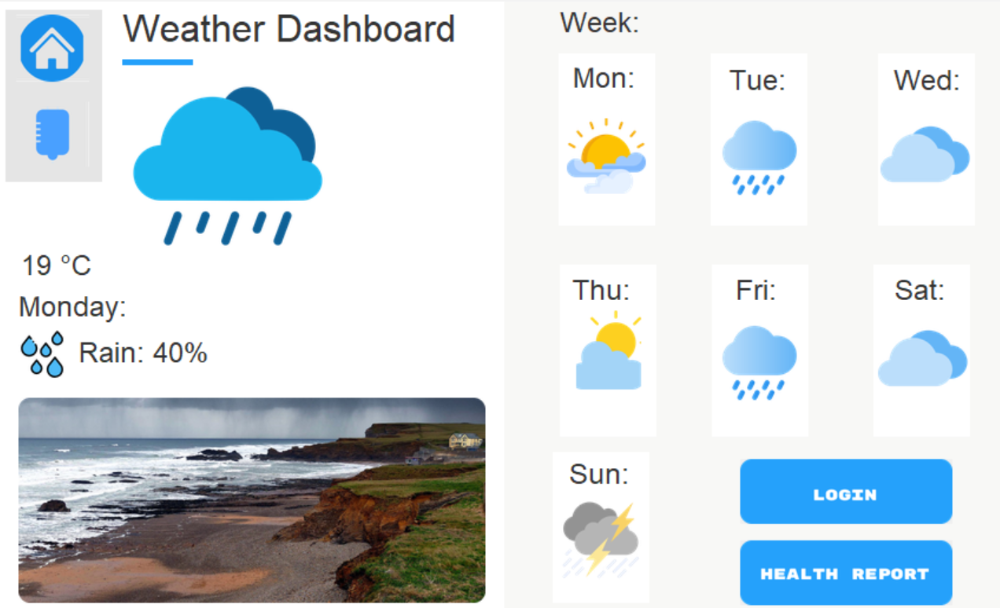

<!--
repo name: OCC-Mock
description: Documentation of the OCC Mock Designs
github name:  FindlayProgramming
link: https://github.com/FindlayProgramming/OCC-Mock
logo path: Images/Dashboard1.png
screenshot:
twitter: username
email: findlay.duffey2@gmail.com
-->

<!-- PROJECT LOGO -->
 

    
<h3 align="center"><a href="https://github.com/FindlayProgramming">OCC Repo</a></h3>
    

        Instructions
         
        <a href="https://github.com/ParthJadhav/Tkinter-Designer/blob/master/docs/instructions.md"><strong>Tkinter-Designer Instructions !Please Follow this!📃</strong></a>
         
         
    

<!-- TABLE OF CONTENTS -->
## Table of Contents
  - [Requirements](#Requirements)
- [Built With](#Built-with)
- [Documentation](#Documentation)
- [Includes](#Includes)
- [Credits](#Credits-To)

<!-- Requirements -->
## Requirements

Here includes the Health Advice Group designs and how they have been used:

Here's why:
* It increases productivity
* Is very flexible
* Easy to modify

Firstly, before development the client requirements will be mentioned below:

•	The client would like to develop a digital solution that provides:
1.	Weather forecasting to inform health decisions.
2.	Access to a dashboard for monitoring air quality data.
3.	Advice on how to deal with health matters affected by weather and environmental conditions.

•	The client has researched and identified features that could be included in the digital solution, these features are:
1.	Personalised health advice based on location.
2.	Accessibility features to support a wide range of user needs.
3.	A personal health tracking tool.

•	During development the team will:
1.	Implement secure code in at least two appropriate languages to implement front-end and back-end processes.
2.	Gather and prepare appropriate assets to be used in development of the digital solution.
3.	Document and make use of iterative testing.
4.	Document iterative development processes including changes made to the solution during development.
5.	Produce code that can be maintained by a third party.
6.	Ensure a high-quality user experience.
7.	To follow legal and regulatory guidelines and standards.

•	When assets are gathered, the sources will need to be recorded in an assets log recording:
1.	All sources the team has used.
2.	The content and its intended purpose.
3.	The date on which the team retrieved the information.

•	The documentation does not need to include details of every test carried out. However, it should demonstrate:
1.	An iterative approach to testing.
2.	Understanding of how to test inputs, calculations, validation and process using appropriate test data.

### Built With
* [Tkinter-Designer](https://github.com/ParthJadhav/Tkinter-Designer/blob/master/docs/instructions.md#getting-started-1)
* [Figma](https://www.figma.com/login?is_not_gen_0=true)

### Introduction

The build includes assets, packages and prototypes for the client and is all free to access. The assets include frames as well as images for buttons, entries and images etc.

In order to use these programs, Tkinter-Designer is needed as well as other packages it is dependent on such as Pillow, the relevant dll files and poetry.

<!-- Includes -->
## Includes
* Health Advice Group Designs
* The prototypes

### Future Changes

* The future changes have yet to be decided...

### Credits To
* Figma
* ParthJadhav
* Flaticon
